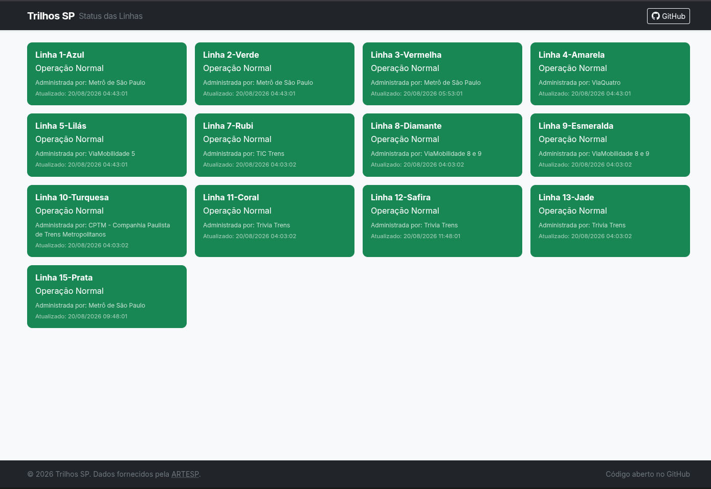

# Trilhos SP

Notificações em tempo real sobre mudanças de status nas linhas dos trens e metrôs de São Paulo, entregues via [Gotify](https://gotify.net/).

Sucessor do [cptm-alerts](https://github.com/rumd3x/cptm-alerts) — projeto PHP que enviava notificações via Slack. A antiga fonte de dados ([diretodostrens.com.br](https://www.diretodostrens.com.br/)) foi encerrada e a obtenção de novas chaves se tornou impossível. Este projeto foi reescrito em Kotlin/Spring com a nova API oficial da ARTESP e troca o Slack pelo Gotify.

---

## Dashboard

A aplicação expõe uma dashboard com o status atual de todas as linhas monitoradas, codificado por cor de acordo com a severidade.

**Demo pública:** [https://trilhossp.edmurcardoso.com.br/](https://trilhossp.edmurcardoso.com.br/)

Ao rodar localmente, acessível em `http://localhost:8080/`.



---

## Obtendo uma API Key

O acesso à API requer autenticação desde 25/06/2026.

1. Faça login no portal e acesse [Minha Conta](https://ccm.artesp.sp.gov.br/contas/minha-conta/)
2. Na seção **Minhas APIs**, solicite acesso ao produto **API Trilhos**
3. Após aprovação, sua chave terá o formato `cci_metro_status_live_<key_id>_<random>`

A chave pode ser fornecida com ou sem o prefixo `cci_metro_status_live_` — a aplicação normaliza automaticamente.

> **Rate limit:** a API permite até 12 requisições por hora. O intervalo de polling padrão é de 10 minutos (6 req/hora), alinhado exatamente à metade do limite.

---

## Rodando com Docker

```bash
docker run --detach \
  --env TRANSIT_API_KEY=cci_metro_status_live_sua_chave \
  --env GOTIFY_URL=https://gotify.example.com \
  --env GOTIFY_TOKEN=seu_app_token \
  --env NOTIFY_LEVEL=2 \
  --env NOTIFY_DAYS=all \
  --env NOTIFY_LINES=all \
  --restart unless-stopped \
  edmur/trilhos-sp:latest
```

### Variáveis de ambiente

| Variável | Obrigatória | Descrição |
|---|---|---|
| `TRANSIT_API_KEY` | ✅ | Chave da API ARTESP |
| `GOTIFY_URL` | ✅ | URL base do servidor Gotify |
| `GOTIFY_TOKEN` | ✅ | App token do Gotify |
| `NOTIFY_LEVEL` | — | Nível mínimo para notificar (padrão: `4`) |
| `NOTIFY_DAYS` | — | Dias para notificar (padrão: `all`) |
| `NOTIFY_LINES` | — | Linhas para monitorar (padrão: `all`) |

### NOTIFY_LEVEL

Notificação é enviada quando o nível da mudança for **maior ou igual** a este valor.

| Nível | Tipo | Descrição |
|---|---|---|
| `0` | Neutro | Mudanças esperadas (ex: encerramento/início de operação) |
| `1` | Positivo | Normalização após período de lentidão |
| `2` | Negativo | Operação com lentidão ou parcial |
| `3` | Crítico | Paralisação total de uma linha |

Exemplos: `NOTIFY_LEVEL=0` notifica todos os níveis · `NOTIFY_LEVEL=2` somente negativos e críticos · `NOTIFY_LEVEL=3` somente paralisações

### NOTIFY_DAYS

`all` ou dias separados por vírgula:

| Valor | Dia |
|---|---|
| `1` | Segunda-feira |
| `2` | Terça-feira |
| `3` | Quarta-feira |
| `4` | Quinta-feira |
| `5` | Sexta-feira |
| `6` | Sábado |
| `7` | Domingo |

Exemplo para dias úteis: `NOTIFY_DAYS=1,2,3,4,5`

### NOTIFY_LINES

`all` ou códigos de linha separados por vírgula.

| Código | Linha |
|---|---|
| `1` | Linha 1 Azul – Metrô |
| `2` | Linha 2 Verde – Metrô |
| `3` | Linha 3 Vermelha – Metrô |
| `4` | Linha 4 Amarela – ViaQuatro |
| `5` | Linha 5 Lilás – ViaMobilidade |
| `7` | Linha 7 Rubi – CPTM |
| `8` | Linha 8 Diamante – ViaMobilidade |
| `9` | Linha 9 Esmeralda – ViaMobilidade |
| `10` | Linha 10 Turquesa – CPTM |
| `11` | Linha 11 Coral – CPTM |
| `12` | Linha 12 Safira – CPTM |
| `13` | Linha 13 Jade – CPTM |
| `15` | Linha 15 Prata – Metrô |

Exemplo: `NOTIFY_LINES=4,5,9`
